# Timelens 原生界面设计审查

日期：2026-09-05。基线提交：`fa4a6b2b910d5985804ea7633a100772803c4e72`。

范围：保留顶部时间范围、左侧应用列表、中间应用详情及右侧功能面板的位置，审查层级、排版、控件、反馈与可访问性。当前阶段为审查与视觉方案，尚未修改应用代码。

本轮使用新建隔离数据集，包含三个虚构应用、合成图片及本机测试提供商。采集暂停、定时截图关闭；审查截图不来自历史验收文件。每张图片均保存后重新打开核对。

## 结论与设计约束

保留现有主要布局。变化集中于区域内部的层级、字号、时间表达、字段标签和控件状态。主代理完成实际操作与截图，子代理独立复核源码及本轮 01、04、07、09 四张关键截图。

| 优先级 | 共用验收要求 | 证据 |
| --- | --- | --- |
| 高 | 模态弹层拦截背景指针输入；建立进入和退出的焦点管理 | 09 已复现点击穿透；键盘路径仍待专项验证 |
| 高 | 时间轴有绝对起止时间、刻度、状态图例；热图零值弱、高频强 | 01、07 |
| 高 | 设置字段始终显示名称、单位及必要范围 | 03、04 |
| 高 | 辅助文字可读，数字和比较列统一对齐 | 01、02、07、10 |
| 中 | 选中、禁用、危险、忙碌、空状态遵循同一套规则 | 01、06、08、11 |

保持顶部范围选择、左侧应用列表、中间详情、右侧功能面板及底部维护区的位置。设计起点为正文 13–14px、辅助文字至少 12px、主要标题 20–24px；小窗口实际效果仍需在实施阶段验证。沿用深蓝底和蓝色强调，通过间距、字重、细分隔与克制的表面差异建立层级。

## 源码补充与证据边界

- [自绘主按钮](../../../crates/timelens-app/src/main.rs#L79)只有 `Rectangle` 与 `TouchArea`，缺少显式焦点及 Enter/Space 路径。业务 UIA 元素未读到；尚不能据此宣称完成键盘或屏幕阅读器验收。
- [顶部与详情复用 segments](../../../crates/timelens-app/src/main.rs#L210)，而[选区按 horizon 归一化](../../../crates/timelens-app/src/main.rs#L1098)、[内容段按 range 归一化](../../../crates/timelens-app/src/main.rs#L1202)。源码存在坐标基准不一致；本轮工具不支持所需的鼠标中键拖动，尚未进行原生交互复现。
- [键盘颜色混合与文字分支](../../../crates/timelens-app/ui/collection-panel.slint#L65)与图 07 的反向亮度一致，属于实施时需要修正的表达问题。
- [AI 设置占位文本](../../../crates/timelens-app/ui/ai-panel.slint#L279)证实图 04 中 30、100、3 分别是保留天数、空间 MiB、每个范围的成功版本数。
- 本轮未验证各分辨率、缩放比例、完整键盘遍历或屏幕阅读器，也未重测后端功能。截图中的空状态和计数来自合成数据。
- 隔离运行已正常退出；本轮生成的数据集和对应测试凭据已由应用自己的清理流程移除，进程数为 0。仅保留本目录的审查证据。

## 01 主界面

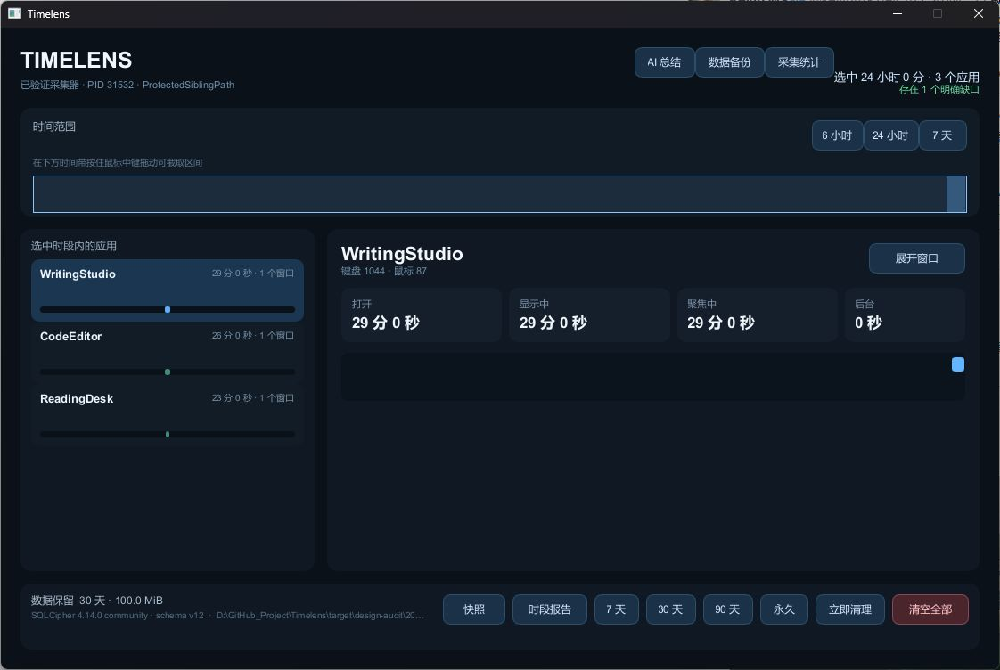

健康度：区域布局清楚，操作与数据关联可以理解；阅读与时间表达需要优先改进。

- 保留：顶部范围选择、左侧应用、中间四项状态及底部维护入口的分区已经稳定。
- 高优先级：时间范围只有相对总长度，缺少绝对起止时刻、轴刻度与状态图例。24 小时视图中的约半小时记录挤在右端，难以判断内容和选区。
- 中优先级：多数说明和元数据很小且偏暗；标题、统计和正文之间需要更明确的字号梯度。
- 中优先级：日期范围、功能导航与采集器技术信息互相争夺页头空间；连接状态应优先使用用户可理解的短文案。
- 中优先级：底部维护按钮视觉权重接近，保留期的当前选中状态不明显，清空动作需要稳定而克制的危险状态。
- 可访问性限制：本轮 Windows UIA 仅读到窗口和标题栏，业务控件未暴露；截图不能证明键盘、屏幕阅读器或完整可访问性合规。当前最大化按钮为禁用状态。

## 02 展开窗口详情

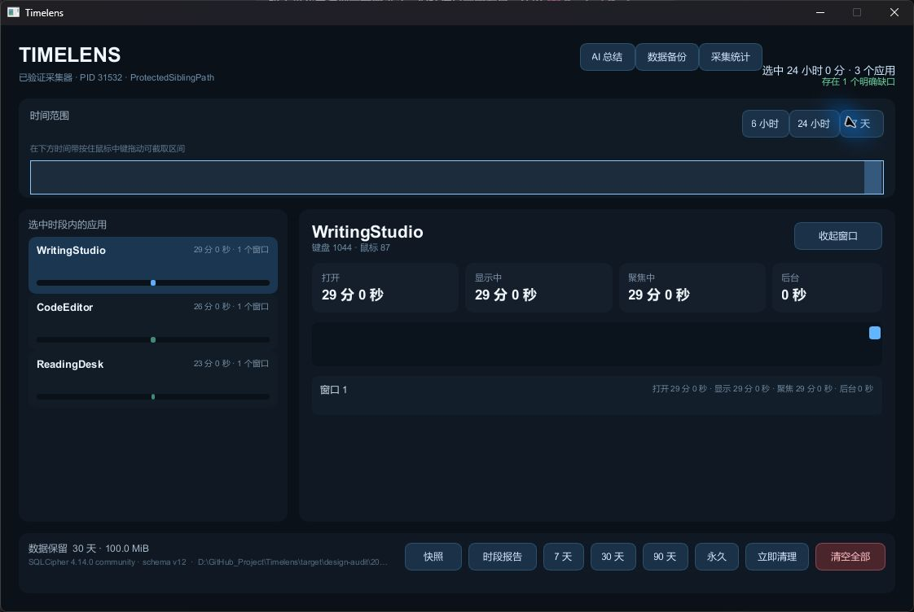

健康度：展开/收起行为正常，主布局保持稳定。窗口行只出现一个紧凑摘要，右侧说明字号过小；四个汇总与行内重复的四项时长缺少清晰层级。建议保持原位，采用统一数字排版、明确的列或分隔，以及可读的辅助字号。

## 03 AI 总结与对话

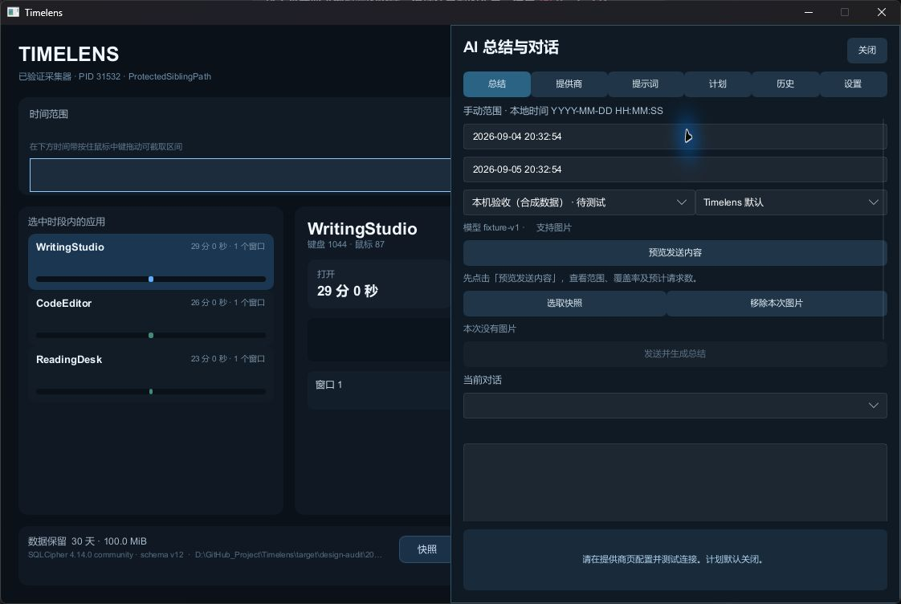

健康度：右侧面板与六个功能页位置明确，发送动作会按条件禁用；表单密度和首次使用引导需要改进。

- 高优先级：开始/结束时间没有各自持续可见的字段名，两个日期输入只靠顺序区分。
- 中优先级：未连接提供商、未有对话时，大量输入与空白区域同时出现，真正下一步“配置并测试连接”位于面板底部。应在原区域内突出当前任务与阻塞原因。
- 中优先级：几乎所有动作使用同一蓝色块和相似权重；预览、图片处理与发送的主次不够清晰。
- 中优先级：整组表单贴近右侧滚动边缘，辅助文字小且灰暗，标签、输入、说明之间应统一间距。
- 限制：本轮审查未向外部 AI 提供商发送内容，此屏为真实应用的未连接/无对话状态。

## 04 AI 设置

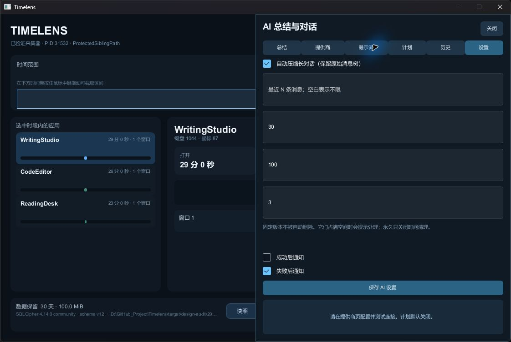

健康度：当前页签和复选框状态可辨，字段语义存在明显缺口。

- 高优先级：三个已填数字输入只显示 30、100、3，缺少持续可见的字段名和单位，用户无法直接知道每个值的用途。为空的“最近 N 条消息”仍依赖占位提示。
- 中优先级：每个单行字段占据约 70 像素高度，使简单设置拉得很长；同一保存按钮下混合对话压缩、版本保留和通知，分组不清晰。
- 建议：保留侧栏及页签，按功能分组，为每项增加标签、单位、范围和适量说明，统一为紧凑可读的输入高度。
- 限制：只查看设置，未保存或更改数值。

## 05 数据与备份

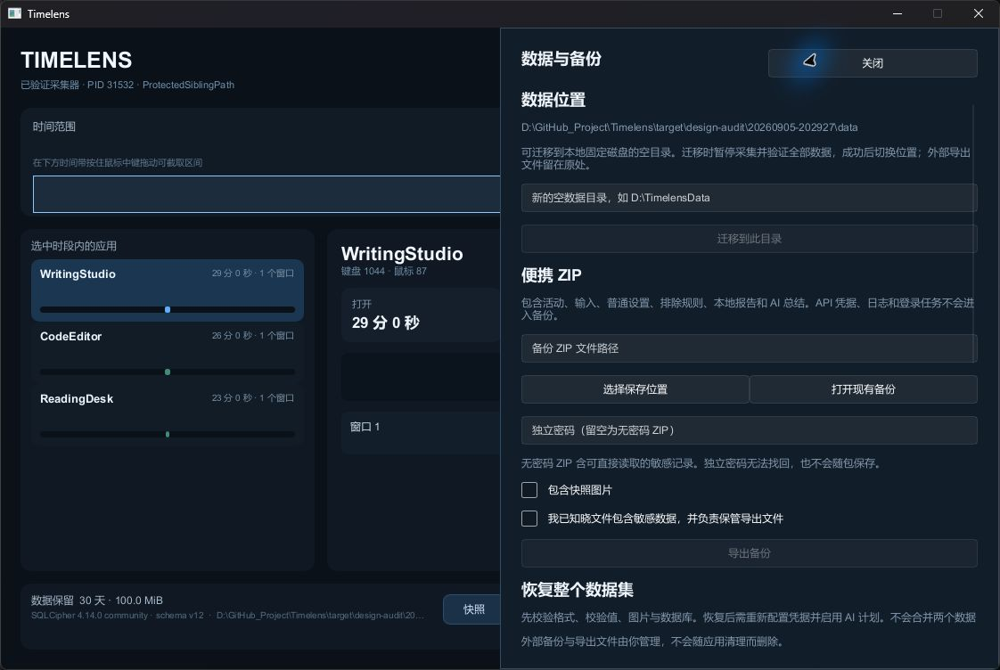

健康度：迁移、导出和恢复已分组，敏感数据与导出条件解释充分；操作密度和后半段发现性需要改进。

- 保留：导出条件未满足时按钮禁用，恢复整个数据集的语义明确。
- 中优先级：完整数据路径很长且难读；路径、输入说明、风险说明使用接近的低对比文字层级。
- 中优先级：大面积“关闭”与主要操作同样宽；导出动作需要经过多段说明、两个复选框，尚未进入任务时就呈现大量信息。
- 中优先级：恢复操作被挤到首屏下方，细滚动条不够醒目，应明确分组边界并保持标题、字段和动作的固定节奏。
- 限制：查看和导航正常；未执行迁移、导出、恢复或写入任何外部位置。

## 06 采集与统计：排除与暂停

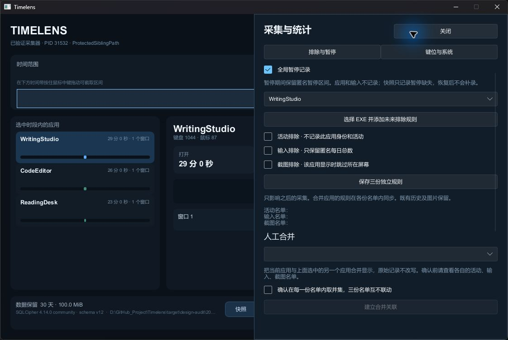

健康度：全局暂停和三种独立排除规则写得清楚，规则应用范围有解释；当前页签、空名单和人工合并的层级需要加强。

- 中优先级：两个页签外观相同，无法从视觉上直接看出当前处于“排除与暂停”。
- 中优先级：活动、输入、截图三行名单没有内容时仅剩标签；应提供明确且简短的空状态。
- 中优先级：全局开关、选应用、排除规则和人工合并紧接在一起，标题与间距不足以表达作用范围。
- 限制：未切换全局暂停、排除项或执行应用合并。

## 07 采集与统计：键位与系统

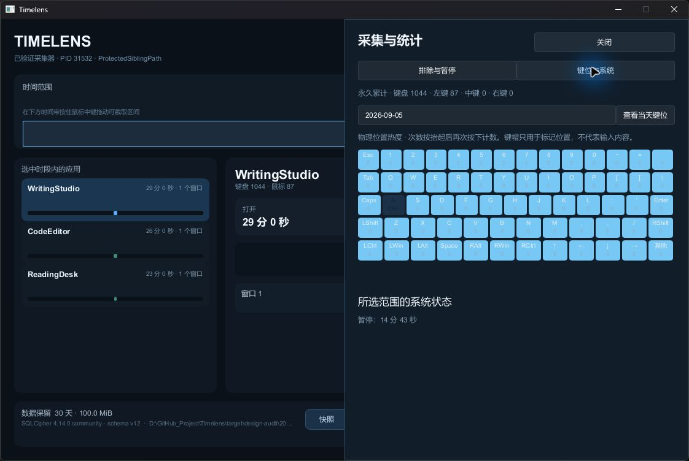

健康度：键盘布局和系统暂停状态均有呈现；热度表达和可读性需要优先修正。

- 高优先级：大部分零计数键使用明亮浅蓝底色，文字与数字也很浅；高计数 A 键反而接近深色。缺少热度图例，容易把未使用误看为热点，且计数难读。
- 中优先级：日期字段、累计总量和当前日期明细需要分清范围。“查看当天键位”动作明确，但日期仅靠当前值辨识。
- 建议：保留键盘原位置和几何分组，以弱底色表达零值、逐级增强表达高频，并增加可读图例及高对比键名。
- 限制：本页只包含合成键位统计，不包含输入内容；未做多分辨率适配验证。

## 08 定时屏幕快照

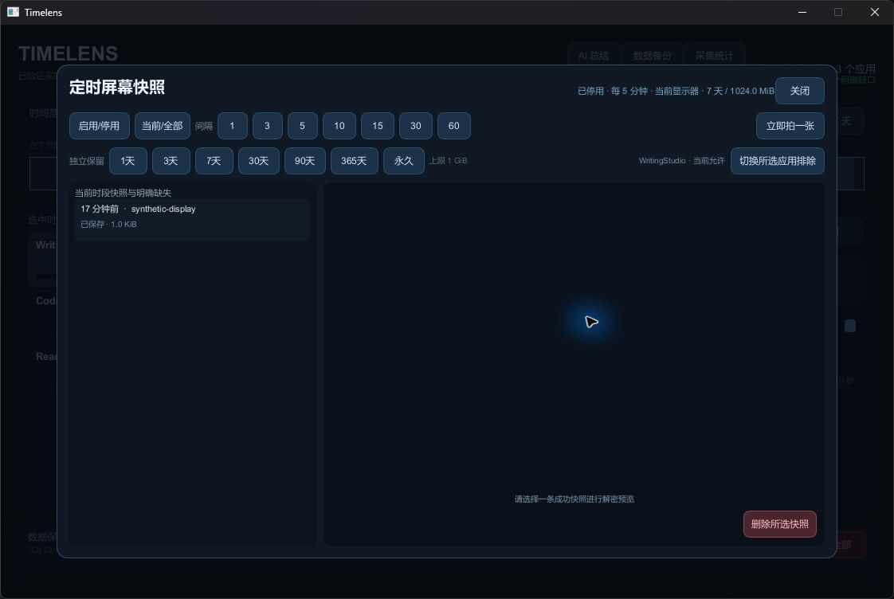

健康度：列表与预览位置清楚，关闭入口明显；配置的当前状态和未选中状态需要改善。

- 中优先级：间隔、保留期的多枚按钮没有持续选中样式，当前设置被压到右上角很小的单行摘要中。
- 中优先级：初始未选中图片时，预览区提示位于靠近底部的位置，“删除所选快照”却已显示为可用的危险按钮。
- 建议：保持列表/预览双列和顶部工具区，采用明确的分段选择器；未选中时在预览中央显示下一步，并禁用删除。
- 限制：定时截图保持停用；本轮未点击“立即拍一张”或删除快照，列表来自事先生成的合成图片。

## 09 快照弹层：底层点击穿透

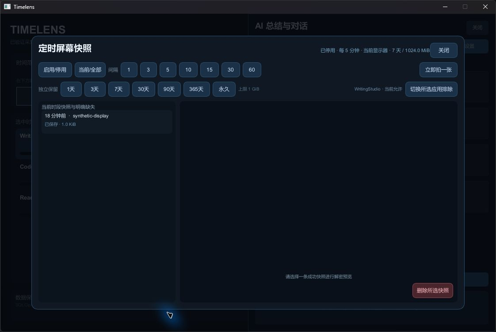

健康度：存在已复现的交互缺陷，优先修复。

- 高优先级：快照弹层保持打开时，在遮罩区域点击底层“AI 总结”入口，后方 AI 侧栏确实打开。截图中可同时看到前方快照弹层与后方“AI 总结与对话”标题。
- 影响：用户以为操作被弹层隔离，背景状态却发生变化；若其他底层动作也可触达，会增加误操作风险。
- 建议：模态遮罩统一拦截指针输入，并管理键盘焦点与返回位置；此项属于交互修复，不能仅靠视觉遮罩完成。
- 限制：只用非破坏性的导航入口验证穿透，没有点击遮罩后的删除或设置动作。

## 10 本地时段报告

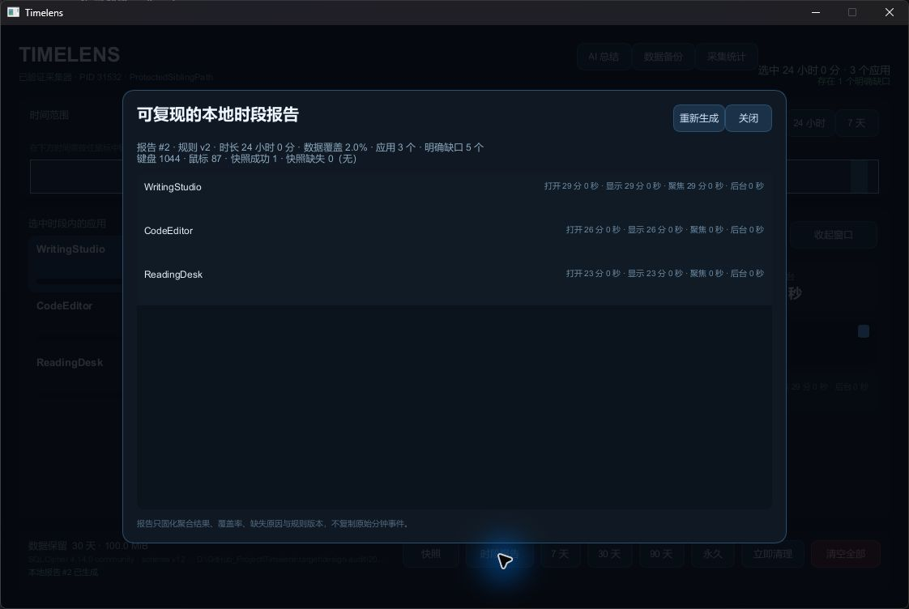

健康度：生成过程有状态提示，报告生成成功；阅读组织需要加强。

- 保留：报告编号、规则版本、覆盖率和缺口均有披露，可追溯性清楚。
- 中优先级：三个应用的多项时长被压成右对齐的小字长句，主体剩余大片空白；缺少列标题和统一数字对齐，不利于比较。
- 中优先级：摘要将时长、覆盖率、应用、缺口、输入、快照混在两行说明中，重要的数据质量提示没有突出。
- 建议：在原弹层和原列表位置内采用可读的摘要行、带标题的数据列及清晰缺口提示。
- 限制：初次加载截图已丢弃并替换为完成后的有效截图；只生成了隔离数据集的本地报告。

## 11 清空确认

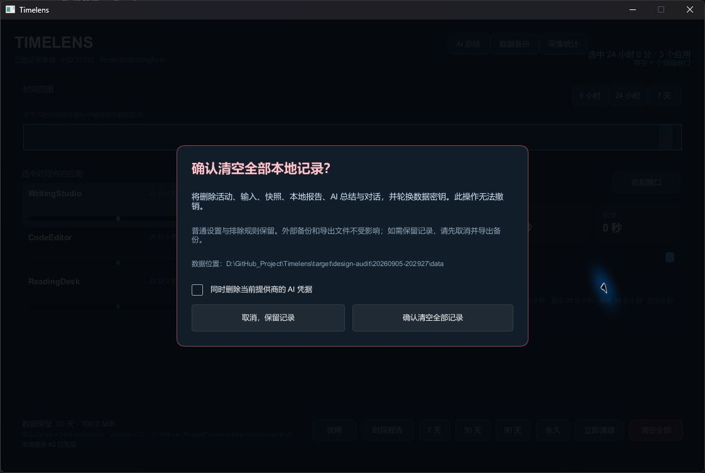

健康度：确认层完整说明删除范围、不可撤销性、保留内容及凭据选项，取消路径清楚；危险动作样式需要一致。

- 保留：没有单击立即清空；取消按钮文案明确为“取消，保留记录”。
- 中优先级：标题为危险色，但“确认清空全部记录”按钮和取消按钮同样为中性灰，未延续底部入口的危险动作样式。
- 中优先级：路径和第二段说明偏小偏暗；必要信息需要足够对比度。
- 限制：只打开确认层并取消，未执行清空。
